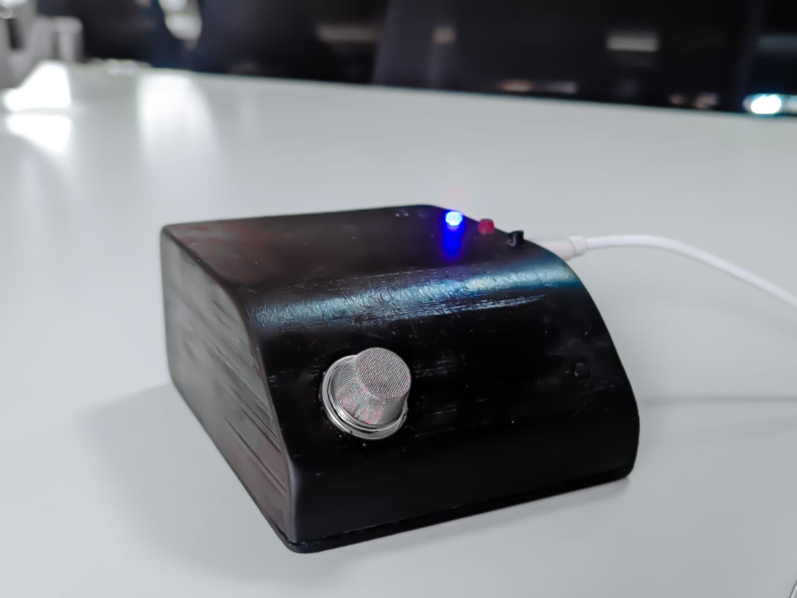
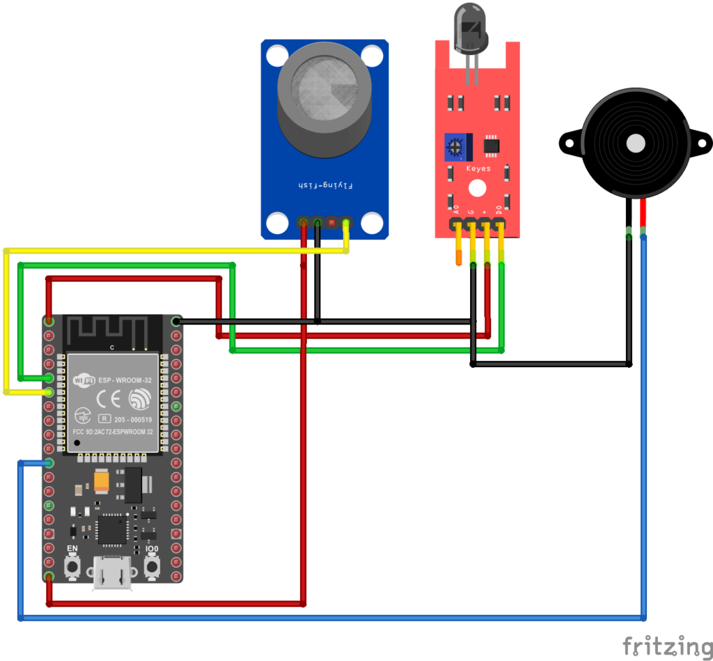

# 🔥 IoT-Based Gas & Fire Detection System with SMS Alerts
> Real-time industrial safety monitoring using ESP32, FreeRTOS, and SMS notifications.

---
  

## 📌 Project Overview
This project implements a robust IoT safety monitoring system designed to detect hazardous gas leaks and fire outbreaks. Built on the ESP32 microcontroller, it utilizes FreeRTOS for efficient multitasking. The system continuously monitors sensor data and, upon detecting danger, activates a local alarm and sends instant SMS alerts to a designated mobile number via an external API.

### 🎯 Key Features
* Real-time Monitoring: Continuously reads analog gas levels and digital flame sensor inputs.
* Dual Alert System:
    * 🔊 Local: Piezo buzzer alarm for immediate on-site warning.
    * 📱 Remote: SMS alerts sent via HTTP POST request.
* Dynamic Security: Fetches API keys securely from a remote GitHub Gist to prevent hardcoding sensitive credentials.
* Intelligent Filtering:
    * False Positive Rejection: Requires 10 seconds of continuous detection before triggering alarms.
    * Spam Prevention: Limits SMS alerts to a maximum of 3 per event to avoid flooding the user.
* Multitasking Architecture: Uses FreeRTOS tasks to handle WiFi connectivity, sensor reading, and buzzer control independently.

---

## 🧠 System Architecture

1. Sensors (MQ-2 / Flame) -> Readings -> Sensor Task
2. Sensor Task -> Danger Detected > 10s -> Trigger Alert
3. Trigger Alert -> Local -> Buzzer Task
4. Trigger Alert -> Remote -> SMS Function
5. SMS Function -> HTTP POST -> SMS Gateway API
6. WiFi Task -> Connect & Fetch API Key -> Global Configuration

---

## 🧰 Hardware & Pinout

### Components
* Microcontroller: ESP32 Development Board
* Sensors:
    * MQ-2 / MQ-5 Gas Sensor (Analog & Digital)
    * IR Flame Sensor
* Output:
    * Active Buzzer
    * Status LED
* Power: 5V USB or External Supply

### 🔌 Pin Configuration
* Buzzer: GPIO 23 (Output)
* Status LED: GPIO 22 (Output)
* Gas Sensor (Analog): GPIO 34 (Input ADC)
* Gas Sensor (Digital): GPIO 35 (Input Interrupt)
* Flame Sensor: GPIO 32 (Input Interrupt)

---

## ⚙️ Software Configuration

### 1. Library Dependencies
Ensure the following libraries are installed in Arduino IDE:
* WiFi.h (Built-in)
* HTTPClient.h (Built-in)
* WiFiClientSecure.h (Built-in)
* ArduinoJson (v6.x by Benoit Blanchon)

### 2. Network & API Setup
Update the following constants in the code before uploading:

// WiFi Credentials
const char *ssid = "YOUR_WIFI_SSID"; 
const char *password = "YOUR_WIFI_PASSWORD";

// Alert Configuration
const char *mobileNumber = "919999999999"; // Format: CountryCode + Number
const char *templateID = "101"; // SMS Gateway Template ID

### 3. Dynamic API Key (Gist Method)
The system fetches the SMS API key from a secure GitHub Gist to allow remote updates without reflashing the code.
* URL: Defined in 'gistUrl' variable.
* Format: The Gist must return a raw JSON object:
    {
      "api_key": "YOUR_SECRET_API_KEY"
    }

---

## 🧭 Operational Logic

### 🛡️ Safety & Reliability Logic
1. WiFi Auto-Reconnect: The WiFiTask constantly monitors connection status and reconnects automatically if dropped.
2. API Key Refresh: The system re-fetches the API key every hour (API_FETCH_INTERVAL) to ensure credentials remain valid.
3. Heap Monitoring: Debug logs print ESP.getFreeHeap() before and after heavy network operations to monitor memory usage.

### 🚨 Alert Sequence
1. Detection: Gas > THRESHOLD (600) OR Flame == LOW.
2. Verification: Condition must persist for 10 seconds.
3. Action:
    * Buzzer pulses for 5 seconds.
    * SMS is sent (Max 3 times per continuous event).
    * System resets SMS counter only when sensor readings return to normal.

---

## 👤 Author
Akhiljith Gigi
Robotics Engineer | Embedded Systems Enthusiast

---

## 📜 License
This project is open-source and licensed under the MIT License.
